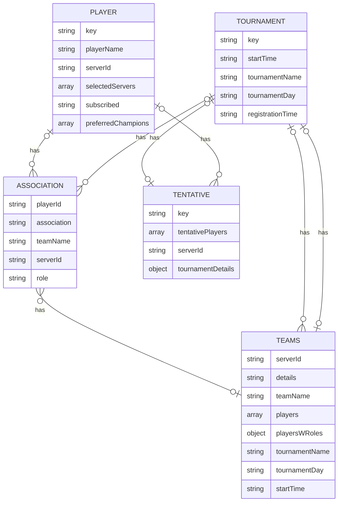

# Clash Bot Webapp
## Summary
- Used to support the scheduling, creation, and notification of upcoming League of Legends Clash Tournaments.

## Entity Model

```mermaid
erDiagram
    PLAYER {
        string key
        string playerName
        string serverId
        array selectedServers
        string subscribed
        array preferredChampions
    }
    ASSOCIATION {
        string playerId
        string association
        string teamName
        string serverId
        string role
    }
    TEAMS {
        string serverId
        string details
        string teamName
        array players
        object playersWRoles
        string tournamentName
        string tournamentDay
        string startTime
    }
    TOURNAMENT {
        string key
        string startTime
        string tournamentName
        string tournamentDay
        string registrationTime
    }
    TENTATIVE {
        string key
        array tentativePlayers
        string serverId
        object tournamentDetails
    }
    PLAYER |o--o{ ASSOCIATION: has
    ASSOCIATION }o--o| TEAMS: has
    TOURNAMENT |o--o{ TEAMS: has
    TOURNAMENT |o--o| TENTATIVE: has
    PLAYER |o--o{ TENTATIVE: has
    TOURNAMENT |o--o| TEAMS: has
    TOURNAMENT |o--o{ ASSOCIATION: has
```
