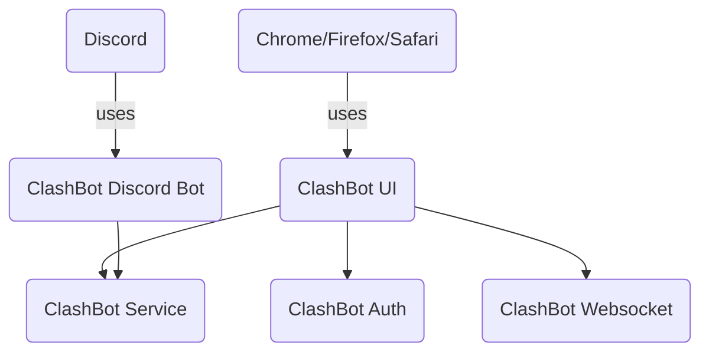

# Clash-Bot-WebApp

## Summary
Ever wanted to be able to prepare for a League of Legends Clash Tournament but no one on your Discord Server likes to communicate?? Look no further! Clash Bot is here!

Clash Bot will notify you of upcoming League of Legends Clash Tournaments, setup role based Teams, provide a way for you to assign preferred champions and let you specify that you are Tentatively available for a Tournament.

## Project Setup
| Project                  | Summary                                                                                                                |
|--------------------------|------------------------------------------------------------------------------------------------------------------------|
| ClashBot-UI              | The front end webapp used for interaction with the Clash Bot.                                                          |
| ClashBot-OpenAPI         | The rest and async service contract specified for the Clash Bot.                                                       |
| ClashBot-Auth-OpenAPI    | Used to support integration with Discord OAuth2.                                                                       |
| ClashBot-Service-OpenAPI | The rest service that supports the Clash Bot scheduling functionality.                                                 |
| ClashBot-WS-Service      | The websocket service that supports realtime notification of the Clash Bot scheduling.                                 |
| ClashBot-E2E             | The E2E test suite to verify the functionality between ClashBot-UI, ClashBot-Service-OpenAPI, and ClashBot-WS-Service. |

## Flowchart of the Clash-Bot Project

## Disclaimer
Clash-Bot is not endorsed by Riot Games and does not reflect the views or opinions of Riot Games or anyone officially involved in producing or managing League of Legends. League of Legends and Riot Games are trademarks or registered trademarks of Riot Games, Inc. League of Legends © Riot Games, Inc.
